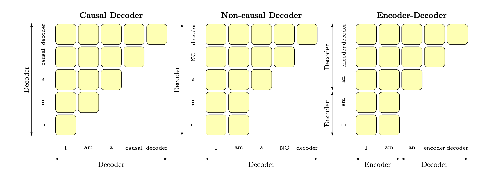

# 1.llm概念

\[toc]

### 1.先搞清楚：LLM 到底是什么？

LLM 是 Large Language Model，即大语言模型。它不是某一个具体模型，而是一类模型：用大量文本训练出来，能够理解、生成、改写、总结、问答、写代码、调用工具的语言模型。

对应用开发者来说，可以先把 LLM 理解成一个“文本输入 -> 文本或结构化输出”的智能组件：

```text
用户问题 / 系统提示 / 工具结果 / 知识库内容
        ↓
       LLM
        ↓
回答 / JSON / 工具调用参数 / 下一步计划
```

做 AI Agent 开发时，重点不是先弄懂模型如何训练出来，而是理解：

1. 模型能接收什么输入。
2. 模型会如何生成输出。
3. 模型适合做什么，不适合做什么。
4. 模型如何和工具、数据库、知识库、业务系统连接起来。

### 2.主流模型体系有哪些？它们有什么区别？

很多文章会把 GPT、BERT、T5、XLNet、RoBERTa 放在一起讲，但它们其实不是同一种用途的模型。更清晰的理解方式是：先按**模型架构**看，也就是看 Transformer 里主要使用 Encoder、Decoder，还是两者都用。

> 这一节先回答“模型结构长什么样”；下一节再回答“模型预测 token 时能看见哪些上下文”。

| 架构类型 | 代表模型 | 核心特点 | 主要适合场景 | 和 Agent 开发的关系 |
| --- | --- | --- | --- | --- |
| Decoder-only | GPT、LLaMA、Qwen、DeepSeek、ChatGLM 部分版本 | 只使用 Transformer Decoder，通常从左到右生成文本 | 对话、写作、代码生成、工具调用、复杂任务执行 | 最重要，现代 Agent 的主力架构 |
| Encoder-only | BERT、RoBERTa | 只使用 Transformer Encoder，擅长理解文本，不擅长直接长文本生成 | 文本分类、匹配、排序、语义理解、向量表示 | 可用于检索、分类、重排等辅助模块 |
| Encoder-Decoder | T5、BART | Encoder 理解输入，Decoder 生成输出 | 翻译、摘要、问答、文本转换 | 有用，但现代通用 Agent 主力较少 |
| 特殊路线 | XLNet、UniLM、GLM 等 | 在注意力机制、训练目标或生成方式上做特殊设计 | 研究、特定任务、部分生成任务 | 了解即可，不是 Agent 入门重点 |

注意：很多资料会把 `Decoder-only` 和 `Causal LM` 连在一起说，因为现代对话大模型通常同时满足这两个特征。但严格来说，它们不是同一层概念。

- `Decoder-only` 说的是**模型架构**：Transformer 里主要使用 Decoder 部分。
- `Causal LM` 说的是**建模方式 / 训练目标**：模型从左到右预测下一个 token，不能看未来 token。

所以 GPT、LLaMA、Qwen、DeepSeek 这类模型可以先理解为：

```text
Decoder-only 架构 + Causal LM 建模方式
```

简单说，`Decoder-only` 是身体结构，`Causal LM` 是它生成文本的规则。

这里先建立概念即可：`Decoder` 是 Transformer 架构的一部分，具体 Encoder、Decoder、Attention 如何工作，后续阅读 `02.大语言模型架构/05.Transformer架构细节/05.Transformer架构细节.md` 时再展开学习。

#### 2.1 GPT 类模型

GPT 是 Generative Pre-trained Transformer，属于典型的 Decoder-only 架构。它通常采用 Causal LM 方式训练：给定前面的 token，预测下一个 token。

这种结构天然适合生成任务，所以后来的很多聊天模型、代码模型、Agent 模型都沿用了类似路线。

#### 2.2 BERT 类模型

BERT 是 Encoder-only 模型。它的特点是可以同时看一个 token 左右两边的上下文，因此很适合理解文本。

但 BERT 不是典型的聊天生成模型。它更常见的用途是文本分类、语义匹配、关键词识别、向量表示、检索排序等。

#### 2.3 T5 类模型

T5 是 Encoder-Decoder 模型。Encoder 负责理解输入，Decoder 负责生成输出。它把很多 NLP 任务都统一成 text-to-text，也就是“输入文本，输出文本”。

这种结构很适合翻译、摘要、问答等任务，但在当前通用对话和 Agent 场景里，主流更多是 Decoder-only 模型。

#### 2.4 DeepSeek 属于哪类？

DeepSeek 是现代大语言模型家族。站在 AI Agent 开发视角，它和 GPT、LLaMA、Qwen 更接近，属于面向生成、对话、代码和推理任务的现代 LLM。

更具体地说，DeepSeek 这类模型通常属于 Decoder-only 架构，并采用类似 Causal LM 的生成方式，同时可能在模型结构和训练方法上加入 MoE、长上下文、代码训练、推理增强等技术。作为应用开发者，优先把它理解成“可用于对话、推理、代码、工具调用的生成式 LLM”即可。

### 3.Causal LM、Prefix LM 是什么？为什么还要讲它们？

前面一节是从**模型架构**分类：Encoder-only、Decoder-only、Encoder-Decoder。

这一节换一个角度：从**语言建模方式**看。它回答的是另一个问题：

> 模型在预测某个 token 时，到底可以看到哪些上下文？

理解它们之前，先理解 token。模型并不是直接按“字”或“词”思考，而是先把文本切成 token。语言模型的核心任务通常就是：根据上下文，预测某个位置的 token。

#### 3.1 Causal LM：只能看过去，从左到右续写

Causal LM 可以理解为“因果语言模型”或“自回归语言模型”。它生成当前位置时，只能看见当前位置之前的内容，不能偷看未来。

例如：

```text
输入：今天北京天气
模型预测下一个 token：不错 / 很 / 晴朗 / ...
```

它的注意力规则大致是：

```text
第 1 个 token：只能看自己
第 2 个 token：能看第 1、2 个
第 3 个 token：能看第 1、2、3 个
第 4 个 token：能看第 1、2、3、4 个
```

这就是 GPT、LLaMA、Qwen、DeepSeek 等现代生成式 LLM 的主流路线。它非常适合对话、写代码、生成 JSON、规划下一步动作、调用工具。

#### 3.2 Prefix LM：前缀充分理解，后面继续生成

Prefix LM 可以理解为：前面有一段 prefix 输入，这段输入内部可以互相看见；模型开始生成答案时，则仍然按照从左到右的方式生成，不能看未来。

它的注意力规则大致是：

```text
prefix 部分：内部 token 之间可以互相看见
生成部分：可以看见整个 prefix，也可以看见已经生成的 token，但不能看未来 token
```

所以 Prefix LM 有点像把“理解输入”和“生成输出”放到一个模型结构里完成。它和 Encoder-Decoder 有相似之处，但不是完全相同的结构。代表路线包括 UniLM、GLM 等。

#### 3.3 架构分类和建模方式的关系

容易混的点在这里：**架构分类**和**建模方式分类**经常一起出现，但它们不是同一个维度。

| 维度 | 关心的问题 | 常见概念 |
| --- | --- | --- |
| 模型架构 | 模型由哪些部分组成？ | Encoder-only、Decoder-only、Encoder-Decoder |
| 建模方式 | 预测 token 时能看见哪些上下文？ | Causal LM、Prefix LM、Masked LM |

常见对应关系可以这样记：

```text
Encoder-only：常见于 BERT、RoBERTa
└─ 通常配合 Masked LM，用来做文本理解

Encoder-Decoder：常见于 T5、BART
└─ 通常用于输入文本到输出文本的转换

Decoder-only：常见于 GPT、LLaMA、Qwen、DeepSeek
└─ 通常配合 Causal LM，用来做对话、生成、代码、Agent 工具调用

Prefix LM：一种特殊建模方式
└─ prefix 内部可双向理解，生成部分仍然从左到右
```

对 AI Agent 开发来说，最需要优先关注的是 `Decoder-only + Causal LM`，因为它是当前对话模型和 Agent 模型的主流。Prefix LM、BERT、T5 可以作为背景知识，先知道它们解决的问题不同即可。

#### 3.4 面试表达

如果面试官问“Decoder-only 和 Causal LM 是一回事吗？”，可以这样回答：

> 不是一回事。Decoder-only 是模型架构，表示模型主要使用 Transformer Decoder；Causal LM 是语言建模方式，表示模型按从左到右的顺序预测下一个 token，不能看到未来 token。只是在现代 GPT、LLaMA、Qwen、DeepSeek 这类模型中，二者经常一起出现，所以很多资料会写成 Decoder-only / Causal LM。简单说，Decoder-only 是结构，Causal LM 是生成规则。

### 4.大模型LLM的 训练目标

大型语言模型（Large Language Models，LLM）的训练目标通常是**最大似然估计（Maximum Likelihood Estimation，MLE）**。最大似然估计是一种统计方法，用于从给定数据中估计概率模型的参数。

在LLM的训练过程中，使用的数据通常是大量的文本语料库。训练目标是**最大化模型生成训练数据中观察到的文本序列的概率**。具体来说，对于每个文本序列，模型根据前面的上下文生成下一个词的条件概率分布，并通过最大化生成的词序列的概率来优化模型参数。

为了最大化似然函数，可以使用梯度下降等优化算法来更新模型参数，使得模型生成的文本序列的概率逐步提高。在训练过程中，通常会使用批量训练（batch training）的方法，通过每次处理一小批数据样本来进行参数更新。

#### 4.1 从工程视角理解：LLM 本质是 next-token predictor

从工程视角看，LLM 本质上可以理解为一个**基于上下文预测下一个 token 的概率分布的预测器**。

它不是一次性根据用户输入“匹配出一个完整答案”，而是不断重复下面这个过程：

```text
已有上下文 tokens
↓
预测下一个 token 的概率分布
↓
根据解码策略选择 / 采样一个 token
↓
把新 token 加回上下文
↓
继续预测下一个 token
```

例如给定上下文：

```text
RAG 是一种
```

模型要做的事情不是直接生成完整回答，而是预测下一个 token 的概率分布：

```text
P(结合 | RAG 是一种)
P(检索 | RAG 是一种)
P(方法 | RAG 是一种)
...
```

训练阶段的 MLE 目标，就是让训练语料中真实出现的下一个 token 概率尽可能高。推理阶段则会根据具体的解码策略生成 token，例如：

```text
greedy decoding：每一步都选概率最高的 token
temperature：调节输出的随机性
top-k / top-p：只在较高概率的一部分 token 中采样
```

所以可以用一句话概括：

> LLM 是一个 next-token predictor；它根据上下文预测下一个 token 的概率分布，并通过连续生成 token 形成最终回答。

### 5.补充：大模型为什么会表现出涌现能力？

[大语言模型的涌现能力：现象与解释 - 知乎 (zhihu.com)](https://zhuanlan.zhihu.com/p/621438653 "大语言模型的涌现能力：现象与解释 - 知乎 (zhihu.com)")

前面讨论的是 LLM 的基础结构、建模方式和训练目标。随着模型参数规模、训练数据规模和计算量提升，模型会在某些任务上表现出小模型阶段不明显、但大模型阶段突然变强的能力，这类现象通常被称为**涌现能力**。

涌现能力（Emergent Ability）是指**模型在训练过程中能够生成出令人惊喜、创造性和新颖的内容或行为**。这种能力使得模型能够超出其训练数据所提供的内容，并产生出具有创造性和独特性的输出。

涌现能力的产生可以归因于以下几个原因：

1. **任务的评价指标不够平滑**：因为很多任务的评价指标不够平滑，导致我们现在看到的涌现现象。如果评价指标要求很严格，要求一字不错才算对，那么Emoji\_movie任务我们就会看到涌现现象的出现。但是，如果我们把问题形式换成多选题，就是给出几个候选答案，让LLM选，那么随着模型不断增大，任务效果在持续稳定变好，但涌现现象消失，如上图图右所示。这说明评价指标不够平滑，起码是一部分任务看到涌现现象的原因。
2. **复杂任务** **vs** **子任务**：展现出涌现现象的任务有一个共性，就是任务往往是由多个子任务构成的复杂任务。也就是说，最终任务过于复杂，如果仔细分析，可以看出它由多个子任务构成，这时候，子任务效果往往随着模型增大，符合 Scaling Law，而最终任务则体现为涌现现象。
3. **用** **Grokking** （顿悟）**来解释涌现**：对于某个任务T，尽管我们看到的预训练数据总量是巨大的，但是与T相关的训练数据其实数量很少。当我们推大模型规模的时候，往往会伴随着增加预训练数据的数据量操作，这样，当模型规模达到某个点的时候，与任务T相关的数据量，突然就达到了最小要求临界点，于是我们就看到了这个任务产生了Grokking现象。

尽管涌现能力为模型带来了创造性和独特性，但也需要注意其生成的内容可能存在偏差、错误或不完整性。因此，在应用和使用涌现能力强的模型时，需要谨慎评估和验证生成的输出，以确保其质量和准确性。

### 6.为何现在的大模型大部分是 Decoder-only 结构

#### 6.1 什么是 Encoder / Decoder？

这里要先区分两组容易混淆的概念：

```text
Tokenizer 的 encode / decode
Transformer 架构里的 Encoder / Decoder
```

**Tokenizer 的 encode / decode** 指的是文本和 token id 之间的转换：

```text
文本 -> token ids：tokenizer encode
token ids -> 文本：tokenizer decode
```

例如：

```text
"我喜欢 AI" -> [101, 2345, 6789]
[101, 2345, 6789] -> "我喜欢 AI"
```

这只是输入输出层面的格式转换，不是模型架构里的 Encoder / Decoder。

**Transformer 架构里的 Encoder / Decoder** 指的是模型内部的网络结构：

```text
Encoder：把已经给定的输入文本，转换成带上下文语义的内部表示
Decoder：根据已有上下文，一个 token 一个 token 地生成新文本
```

这里的“输入”指的是模型已经拿到的文本，例如：

```text
用户问题：RAG 是什么？
文章内容：RAG 是一种结合检索和生成的方法...
句子：I love machine learning.
```

这些文本会先经过 tokenizer 变成 token ids，然后再进入 Transformer 模型。

Encoder 所谓的“理解输入”，不是人类意义上的理解，而是指：**为输入序列里的每个 token 建立结合上下文后的语义表示**。

例如输入：

```text
苹果 发布 了 新 手机
```

Encoder 的特点是输入 token 之间可以双向注意力，即每个 token 都可以看到整个输入序列：

```text
"苹果" 可以看见 "发布 / 新 / 手机"
"手机" 也可以看见 "苹果 / 发布 / 新"
```

这样模型才能判断：

```text
"苹果" 在这里更像 Apple 公司，而不是水果
"手机" 是被发布的产品
```

所以 Encoder 更适合做理解类任务，例如：

```text
文本分类：这句话是正面还是负面？
语义匹配：这两个句子是不是表达同一个意思？
信息抽取：这段文本里有哪些实体？
向量检索：这段文本和用户问题是否相关？
```

典型模型是 BERT、RoBERTa。

Decoder 所谓的“生成输出”，指的是：**根据已有上下文，继续写出新的 token，最终形成一段人类可读的文本**。

例如用户输入：

```text
解释一下 RAG
```

模型可能生成：

```text
RAG 是 Retrieval-Augmented Generation 的缩写...
```

这个回答不是一次性生成出来的，而是逐 token 生成：

```text
RAG
RAG 是
RAG 是 Retrieval-Augmented
RAG 是 Retrieval-Augmented Generation
...
```

Decoder 的特点是通常使用 causal mask，只能看当前位置以及之前的 token，不能看到未来 token：

```text
生成到 "Retrieval-Augmented" 时，可以看到：
RAG 是

但不能提前看到后面还没生成的：
Generation 的 缩写
```

所以 Decoder 更适合做生成类任务，例如对话、续写、代码生成、总结、Agent 工具调用等。典型模型是 GPT、LLaMA、Qwen、DeepSeek。

需要注意的是，GPT 类 Decoder-only 模型没有单独的 Transformer Encoder。它会把 system prompt、用户问题、历史对话都当成“已有上下文”，然后用 Decoder 继续往后生成：

```text
System: 你是一个助手
User: 解释一下 RAG
Assistant:
↓
RAG 是一种...
```

所以 GPT 类模型的完整流程更准确地说是：

```text
用户文本
↓
Tokenizer encode：文本转 token ids
↓
Decoder-only Transformer：预测下一个 token
↓
生成新的 token ids
↓
Tokenizer decode：token ids 转文本
↓
用户看到的回答
```

所以 GPT 类大模型不是同时包含 Transformer Encoder 和 Transformer Decoder，而是：

```text
Tokenizer encode/decode + Transformer Decoder-only
```

#### 6.2 为什么现在的大模型大部分是 Decoder-only 结构？

现在主流对话大模型大多采用 Decoder-only，核心原因是它天然适合“给定上下文，继续生成后续 token”这个目标。

1. **训练目标简单统一**

Decoder-only 模型通常使用 causal language modeling，也就是根据前文预测下一个 token：

```text
P(next token | previous tokens)
```

这和海量文本、代码、网页语料的自监督训练非常匹配，不需要人工标注输入输出对。

2. **生成任务天然匹配**

对话、代码生成、Agent 工具调用，本质上都可以组织成：

```text
System prompt + User message + 已生成内容
↓
继续预测下一个 token
```

这正是 Decoder-only 最擅长的工作方式。

3. **推理效率更高，适合多轮对话**

Decoder-only 在生成时可以复用 KV Cache。模型每生成一个新 token，只需要基于之前缓存的 key/value 继续计算，而不需要每一步都重新处理完整上下文。

这对长上下文、多轮对话、Agent 循环执行非常重要。

4. **工程实现更统一**

同一个 Decoder-only 模型可以通过不同 prompt 适配很多任务：

```text
问答
总结
翻译
代码生成
工具调用
结构化输出
```

也就是说，它不是为每类任务设计一套独立结构，而是用统一的“上下文续写”方式覆盖大量任务。

一句话总结：

> Encoder 更偏理解，Decoder 更偏生成；现代 ChatGPT、LLaMA、Qwen、DeepSeek 这类模型的核心任务是根据上下文持续生成 token，所以主流架构选择了 Decoder-only。

### 7.大模型架构介绍

Transformer 模型一开始是用来做 seq2seq 任务的，所以它包含 Encoder 和 Decoder 两个部分；他们两者的区别主要是，**Encoder 在抽取序列中某一个词的特征时能够看到整个序列中所有的信息，即上文和下文同时看到**；而 **Decoder 中因为有 mask 机制的存在，使得它在编码某一个词的特征时只能看到自身和它之前的文本信息**。

首先概述几种主要的架构:&#x20;

- 以BERT为代表的**encoder-only**
- 以T5和BART为代表的**encoder-decoder**
- 以GPT为代表的**decoder-only**，
- 以UNILM9为代表的PrefixLM(相比于GPT只改了attention mask，前缀部分是双向，后面要生成的部分是单向的causal mask%)&#x20;



### 8.LLMs复读机问题

#### 8.1 什么是 LLMs 复读机问题？

LLMs复读机问题（LLMs Parroting Problem）是指大型语言模型在生成文本时过度依赖输入文本的复制，而缺乏创造性和独特性。当面对一个问题或指令时，模型可能会简单地复制输入文本的一部分或全部内容，并将其作为生成的输出，而不是提供有意义或新颖的回应。

#### 8.2 为什么会出现 LLMs 复读机问题？

1. **数据偏差**：大型语言模型通常是通过预训练阶段使用大规模无标签数据进行训练的。如果训练数据中存在大量的重复文本或者某些特定的句子或短语出现频率较高，模型在生成文本时可能会倾向于复制这些常见的模式。
2. **训练目标的限制**：大型语言模型的训练通常是基于自监督学习的方法，通过预测下一个词或掩盖词来学习语言模型。这样的训练目标可能使得模型更倾向于生成与输入相似的文本，导致复读机问题的出现。
3. **缺乏多样性的训练数据**：虽然大型语言模型可以处理大规模的数据，但如果训练数据中缺乏多样性的语言表达和语境，模型可能无法学习到足够的多样性和创造性，导致复读机问题的出现。
4. **模型结构和参数设置**：大型语言模型的结构和参数设置也可能对复读机问题产生影响。例如，模型的注意力机制和生成策略可能导致模型更倾向于复制输入的文本。

#### 8.3 如何缓解 LLMs 复读机问题？

为了缓解LLMs复读机问题，可以尝试以下方法：

1. **多样性训练数据**：在训练阶段，使用多样性的语料库来训练模型，避免数据偏差和重复文本的问题。这可以包括从不同领域、不同来源和不同风格的文本中获取数据。
2. **引入噪声**：在生成文本时，引入一些随机性或噪声，例如通过采样不同的词或短语，或者引入随机的变换操作，以增加生成文本的多样性。这可以通过在生成过程中对模型的输出进行采样或添加随机性来实现。
3. **温度参数调整**：温度参数是用来控制生成文本的多样性的一个参数。通过调整温度参数的值，可以控制生成文本的独创性和多样性。较高的温度值会增加随机性，从而减少复读机问题的出现。
4. **Beam搜索调整**：在生成文本时，可以调整Beam搜索算法的参数。Beam搜索是一种常用的生成策略，它在生成过程中维护了一个候选序列的集合。通过调整Beam大小和搜索宽度，可以控制生成文本的多样性和创造性。
5. **后处理和过滤**：对生成的文本进行后处理和过滤，去除重复的句子或短语，以提高生成文本的质量和多样性。可以使用文本相似度计算方法或规则来检测和去除重复的文本。
6. **人工干预和控制**：对于关键任务或敏感场景，可以引入人工干预和控制机制，对生成的文本进行审查和筛选，确保生成结果的准确性和多样性。

需要注意的是，缓解LLMs复读机问题是一个复杂的任务，没有一种通用的解决方案。不同的方法可能适用于不同的场景和任务，需要根据具体情况进行选择和调整。此外，解决复读机问题还需要综合考虑数据、训练目标、模型架构和生成策略等多个因素，需要进一步的研究和实践来提高大型语言模型的生成文本多样性和创造性。

### 9.LLMs输入句子长度理论上可以无限长吗？

**理论上来说，LLMs（大型语言模型）可以处理任意长度的输入句子，但实际上存在一些限制和挑战**。下面是一些相关的考虑因素：

1. **计算资源**：生成长句子需要更多的计算资源，包括内存和计算时间。由于LLMs通常是基于神经网络的模型，计算长句子可能会导致内存不足或计算时间过长的问题。
2. **模型训练和推理**：训练和推理长句子可能会面临一些挑战。在训练阶段，处理长句子可能会导致梯度消失或梯度爆炸的问题，影响模型的收敛性和训练效果。在推理阶段，生成长句子可能会增加模型的错误率和生成时间。
3. **上下文建模**：LLMs是基于上下文建模的模型，长句子的上下文可能会更加复杂和深层。模型需要能够捕捉长句子中的语义和语法结构，以生成准确和连贯的文本。

### 10.什么情况用Bert模型，什么情况用LLaMA、ChatGLM类大模型，咋选？

选择使用哪种大模型，如Bert、LLaMA或ChatGLM，取决于具体的应用场景和需求。下面是一些指导原则：

1. **Bert模型**：Bert是一种预训练的语言模型，**适用于各种自然语言处理任务**，如文本分类、命名实体识别、语义相似度计算等。如果你的任务是通用的文本处理任务，而不依赖于特定领域的知识或语言风格，Bert模型通常是一个不错的选择。Bert由一个Transformer编码器组成，更适合于NLU相关的任务。
2. **LLaMA模型**：LLaMA（Large Language Model Meta AI）包含从 7B 到 65B 的参数范围，训练使用多达14,000亿tokens语料，具有常识推理、问答、数学推理、代码生成、语言理解等能力。LLaMA由一个Transformer解码器组成。训练预料主要为以英语为主的拉丁语系，不包含中日韩文。所以适合于英文文本生成的任务。
3. **ChatGLM模型**：ChatGLM是一个面向对话生成的语言模型，适用于构建聊天机器人、智能客服等对话系统。如果你的应用场景需要模型能够生成连贯、流畅的对话回复，并且需要处理对话上下文、生成多轮对话等，ChatGLM模型可能是一个较好的选择。ChatGLM的架构为Prefix decoder，训练语料为中英双语，中英文比例为1:1。所以适合于中文和英文文本生成的任务。

在选择模型时，还需要考虑以下因素：

- 数据可用性：不同模型可能需要不同类型和规模的数据进行训练。确保你有足够的数据来训练和微调所选择的模型。
- 计算资源：大模型通常需要更多的计算资源和存储空间。确保你有足够的硬件资源来支持所选择的模型的训练和推理。
- 预训练和微调：大模型通常需要进行预训练和微调才能适应特定任务和领域。了解所选择模型的预训练和微调过程，并确保你有相应的数据和时间来完成这些步骤。

最佳选择取决于具体的应用需求和限制条件。在做出决策之前，建议先进行一些实验和评估，以确定哪种模型最适合你的应用场景。

### 11.各个专业领域是否需要各自的大模型来服务？

各个专业领域通常需要各自的大模型来服务，原因如下：

1. **领域特定知识**：不同领域拥有各自特定的知识和术语，需要针对该领域进行训练的大模型才能更好地理解和处理相关文本。例如，在医学领域，需要训练具有医学知识的大模型，以更准确地理解和生成医学文本。
2. **语言风格和惯用语**：各个领域通常有自己独特的语言风格和惯用语，这些特点对于模型的训练和生成都很重要。专门针对某个领域进行训练的大模型可以更好地掌握该领域的语言特点，生成更符合该领域要求的文本。
3. **领域需求的差异**：不同领域对于文本处理的需求也有所差异。例如，金融领域可能更关注数字和统计数据的处理，而法律领域可能更关注法律条款和案例的解析。因此，为了更好地满足不同领域的需求，需要专门针对各个领域进行训练的大模型。
4. **数据稀缺性**：某些领域的数据可能相对较少，无法充分训练通用的大模型。针对特定领域进行训练的大模型可以更好地利用该领域的数据，提高模型的性能和效果。

尽管需要各自的大模型来服务不同领域，但也可以共享一些通用的模型和技术。例如，通用的大模型可以用于处理通用的文本任务，而领域特定的模型可以在通用模型的基础上进行微调和定制，以适应特定领域的需求。这样可以在满足领域需求的同时，减少模型的重复训练和资源消耗。

### 12.如何让大模型处理更长的文本？

要让大模型处理更长的文本，可以考虑以下几个方法：

1. **分块处理**：将长文本分割成较短的片段，然后逐个片段输入模型进行处理。这样可以避免长文本对模型内存和计算资源的压力。在处理分块文本时，可以使用重叠的方式，即将相邻片段的一部分重叠，以保持上下文的连贯性。
2. **层次建模**：通过引入层次结构，将长文本划分为更小的单元。例如，可以将文本分为段落、句子或子句等层次，然后逐层输入模型进行处理。这样可以减少每个单元的长度，提高模型处理长文本的能力。
3. **部分生成**：如果只需要模型生成文本的一部分，而不是整个文本，可以只输入部分文本作为上下文，然后让模型生成所需的部分。例如，输入前一部分文本，让模型生成后续的内容。
4. **注意力机制**：注意力机制可以帮助模型关注输入中的重要部分，可以用于处理长文本时的上下文建模。通过引入注意力机制，模型可以更好地捕捉长文本中的关键信息。
5. **模型结构优化**：通过优化模型结构和参数设置，可以提高模型处理长文本的能力。例如，可以增加模型的层数或参数量，以增加模型的表达能力。还可以使用更高效的模型架构，如Transformer等，以提高长文本的处理效率。

需要注意的是，处理长文本时还需考虑计算资源和时间的限制。较长的文本可能需要更多的内存和计算时间，因此在实际应用中需要根据具体情况进行权衡和调整。
